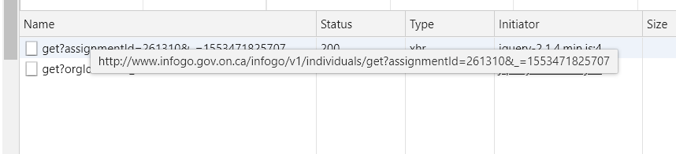

```{r we are a tidyverse household at this time}
library(tidyverse)
library(here)
library(jsonlite)
```

## Infogo Lab Notes - JSON and the API

### Preface

In the initial lab notes, I explored the possibility of scraping Infogo using rvest.
In the process I remembered what happened when I tried to do the same thing on Code Day.
Infogo.gov.on.ca is generated on the client side in javascript, using calls to an API.
I used chrome to find the api to call, and branched off into this notebook to try calling it.

### GET from InfoGo API using httr

Ok, how do I send an API get request to InfoGO?
I found the format of the API call for organizations (see initial_lab_notes).

That is, it looks like you send an orgId in a get request to a url/API specific to querying for organizations.

```{r API get request to infogo}
# url for querying organizations in the OPS
org_url <- "http://www.infogo.gov.on.ca/infogo/v1/organizations/"

# add a sample orgId (OMAFRA's) to make a url to test GET requests with
get_tst_url <- paste0(org_url, "get?orgId=185")

library(httr)
get_tst_content <-
  get_tst_url %>%  # this is the get request url
  httr::GET() %>%  # send an http get request
  httr::content()  # parse the response; should detect it as JSON and parse appropriately
#View(get_tst_content)
# oh neat, it's parsed as a list of named objects

# let's get FASSB's orgId, and save it as an object to test future scripts with:
org_url %>%
  paste0("get?orgId=4827") %>% # looked up fassb's orgId by navigating to it on the website
  httr::GET() %>% httr::content() %>% # fetch and interpret
  saveRDS(file = here("data/raw/fassb_org.rds")) # save to the raw data folder
```

Ok, so now I have a root, at least for a ministry.
How do I traverse the tree?
It looks like there is a list element named childOrgs 

Well, now I know how to get a handily formatted result from InfoGo.
That means I'll have to actually think about:
1) how to traverse this tree,
2) and how to store the results,
3) and what to do with them.
Or at least the first 2.

Oh, and let's look into employees; 
Are there employee ids?
Looks like it;



Let's start from the 'root' employee:
The Secretary of the Cabinet.

### GET employee info on the secretary of the cabinet

```{r employee info test}
# url for querying organizations in the OPS
emp_url <- "http://www.infogo.gov.on.ca/infogo/v1/individuals/"

# add a sample assignmentId, secretary of the cabinet,  to make a url to test GET requests with
get_emp_tst_url <- paste0(emp_url, "get?assignmentId=261310")

get_emp_tst_content <-
  get_emp_tst_url %>%  # this is the get request url
  httr::GET() %>%  # send an http get request
  httr::content()  # parse the response; should detect it as JSON and parse appropriately
#View(get_emp_tst_content)
# I can't see the place in the list with reporting assignments
# There is a reportsTo list, which is empty in this case lol

# Let's get the fassb director (Kirsten!)'s employee info and save it for testing;
# this will let us compare between traversing organizations vs employees 
emp_url %>%
  paste0("get?assignmentId=211327") %>%
  httr::GET() %>% httr::content() %>%
  saveRDS(file = here("data/raw/kirsten_emp.rds"))
```

Ok, I'm going to make a new lab notes file for traversal testing.
Or actually, first I'm going to make lab notes for interactive treemaps:
I'm definitely going to use them as visualizations, and before I choose a data storage format I want to see what format treemaps are expecting.
