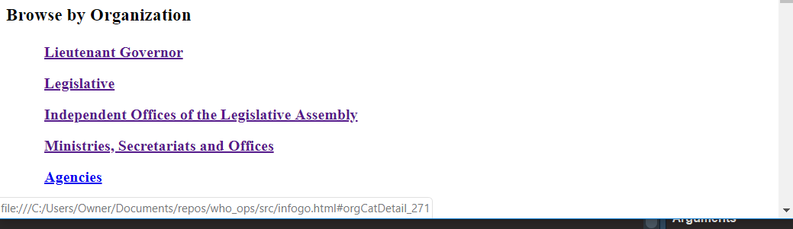
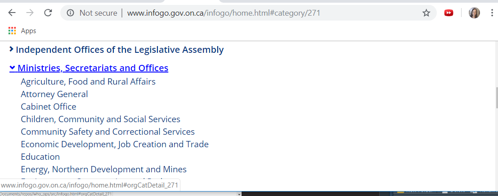
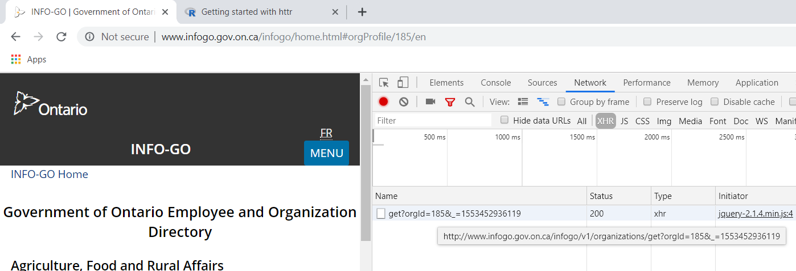
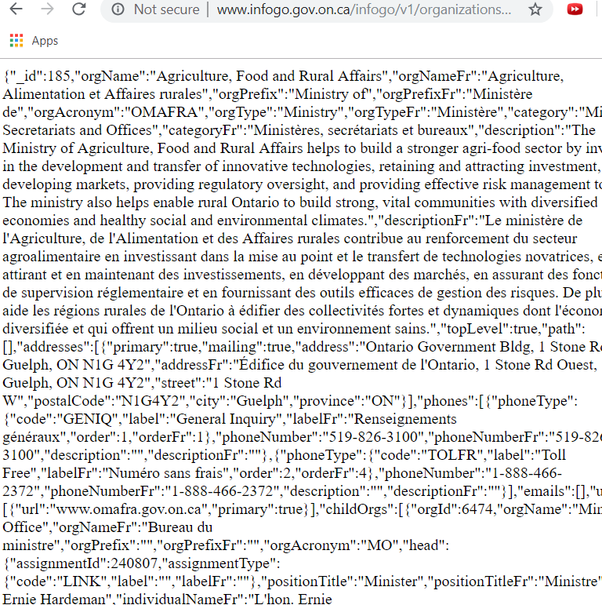

## WHO_OPS - Lab Notes

```{r}
library(here)
```

The plan is to scrape infogo and make:
a) a better, funner, prettier interface, and
b) track changes in employment across the OPS

I tried this once at a code day, and there's a trick that I forget; 
Scraping directly doesn't work because you need a tiny "server" to run the (client-side) javascript that generates the page I think.
We'll see. 
Let's pretend that we don't know that and dig into rvesting:

### Scrape test 1 - rvest

```{r scrape test 1}
# load some libraries
library(tidyverse)
library(rvest)

# store infogo url as variable
infogo_url <- "http://infogo.gov.on.ca"
  
# scrape the website
infogo_root <- read_html(infogo_url)

# View/explore the results in RStudio
# View(infogo_root)
```

Confirmed: The body tag is just full of script tags.
We need a javascript engine to generate the page for us.
I'm starting by reading this:
https://www.r-bloggers.com/scraping-javascript-rendered-web-content-using-r/

Looks like there's an R package called V8 that can execute java code.
Let's try it:

### Scrape test 2 - rvest + V8

```{r}
# load javascript engine library 
library(V8)

# #Read the html page content and extract all javascript codes that are inside a list
# emailjs %>% 
#  html_nodes('li') %>% 
#  html_nodes('script') %>% 
#  html_text()

# Create a new v8 context
v8_context <- v8()

# try using it
# v8_context$eval(src = )
# oh - we need to get the <script>s out of the xml object to feed to v8::eval

# extract script urls from <script> tags
infogo_srcs <-
  infogo_root %>%
  html_nodes("script") %>%
  html_attr("src")

# get scripts to run
library(curl)
infogo_scripts <-
  infogo_srcs %>%
  curl()  
# looks like curl returns an integer?
# ... I don't know what curl does lol 
# Oh, I didn't add the base url

# try running just one:
infogo_script <-
  infogo_srcs[1] %>%
  paste0(infogo_url, "/", .) %>%
  curl() %>% readLines() %>%
  read_html()
# Ok, I clearly don't know what I'm doing with this
```

This wasn't too fun or successful.

I found two other possible plans:
a) RSelenium, which lets you connect to a local java Selenium server that renders the page, and drive that:
https://cran.r-project.org/web/packages/RSelenium/vignettes/basics.html
b) create a phantomjs node that runs all the js and generates an .html file locally to scrape:
https://www.datacamp.com/community/tutorials/scraping-javascript-generated-data-with-r

I'm going to try (b), because I remembered something from code day:
I will probably learn their API interface by doing this, and then wind up just "scraping" by making API calls with jsonlite or something.

### Scrape test 3 - phantomjs

```{r phantomjs test}
# generate a copy of the infogo home page locally to examine:
system("phantomjs scrape_infogo.js")
# it worked - created src/infogo.html - how long did it take?

system.time( system("phantomjs scrape_infogo.js") )
# takes about 6 or 7 seconds
```

That seems to have worked. 
Here's a bit of the resulting local infogo.html:



The text at the bottom shows the url for "Ministries, Secretariats and Offices"
Each of the Orgs had a different value of orgCatDetail, in this case from _268 to _276
Oh, those are anchors, I see. 
On the live website you use them to expand the orgs to see suborgs:


Note the URL.
And maybe "anchor" is the wrong word.
The parts of the url after the hashtag must be...
arguments to the javascript functions? 
And the functions must make API calls?
How did Alex L. Find the API again?

Aha. 
I opened the Network/XHR tabs in Chrome Developer tools and clicked on one of the ministries:



So! 
It looks like I can get organizations by submitting a get request to this url with a query string like this:
http://www.infogo.gov.on.ca/infogo/v1/organizations/get?orgId=185&_=1553452936119

And I get a JSON response like this:


Ok, so clearly this won't be "scraping" really.
I'll be "get"-ing JSON objects and using them to "get" more, climbing the org structure tree. 

Let's put this on github.